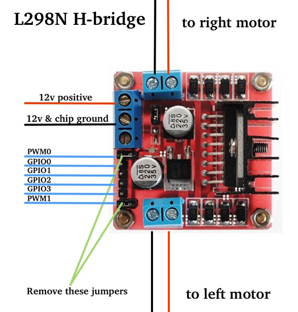
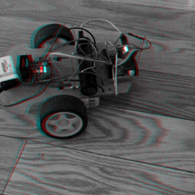

# chipbot
2WD joystick-controlled robot based on NextThingCo's C.H.I.P. platform

This is intended to control two-wheeled robot platforms such as http://a.co/bwBc1Z2 with an L298N H-bridge motor controller via a bluetooth gamepad with two analog joysticks.

This implements soft-PWM on two GPIO pins to control motor speeds. 

Requirements: 
- pygame
- https://github.com/xtacocorex/CHIP_IO

